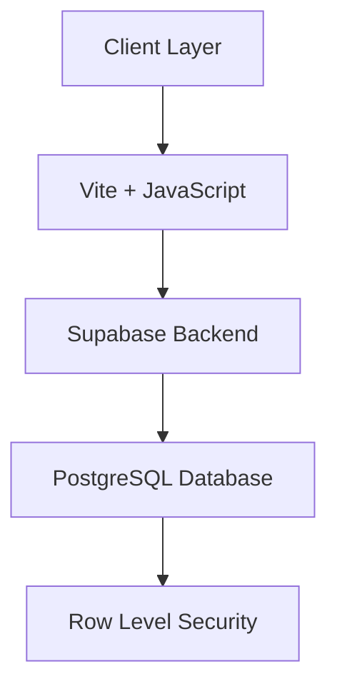

# <div align="center"> COINFESSOL

<div align="center">
  

  <h3 align="center">COINFESSOL - The Digital Sanctuary of Secrets</h3>

  <p align="center">
    A mystical platform where digital whispers become eternal echoes
    <br />
    <a href="https://coinfessol.gitbook.io/coinfessol/"><strong>Explore the ancient scrolls »</strong></a>
    <br />
    <br />
    <a href="https://guileless-piroshki-b6fcbb.netlify.app">View Demo</a>
    ·
    <a href="https://x.com/coinfessol">Follow the Whispers</a>
    ·
    <a href="https://coinfessol.gitbook.io/coinfessol/">Read the Prophecy</a>
  </p>

  <p align="center">
    <a href="https://x.com/coinfessol">
      
    </a>
    
    
  </p>
</div>

## 📜 Introduction

COINFESSOL is not merely a web application; it is a digital sanctuary where thoughts transform into whispers, and confessions become part of an eternal tapestry. Born from the enigmatic Order of the Crimson Code, COINFESSOL represents the convergence of ancient wisdom and modern technology, creating a unique space where anonymity meets authenticity.

## 🌌 Overview

In the depths of digital antiquity, COINFESSOL emerged as a mystical platform crafted by the Order of the Crimson Code. It serves as a sacred repository of human experiences, where each confession contributes to a grand digital tapestry that transcends the conventional boundaries of social interaction.

### Core Philosophy

The foundation of COINFESSOL rests upon three fundamental pillars:

1. **Anonymity**: Every confession is protected by the Veil of Digital Shadows
2. **Authenticity**: True expressions of the human experience
3. **Eternity**: Each whisper becomes part of the eternal digital tapestry

## ⚡ Features

### The Digital Sanctuary

- **Anonymous Confessions**: Share your thoughts without revealing your identity
- **Eternal Storage**: All confessions are preserved in the sacred data streams
- **Voting System**: Support confessions that resonate with your soul
- **Achievement System**: Unlock mystical achievements as you contribute
- **Daily Featured Confession**: The most powerful whisper of the day
- **Interactive Lore**: Discover the deep mythology of COINFESSOL

### Mystical Elements

- **Constellation Grid**: A visual representation of digital consciousness
- **Prophecy Fragments**: Decode ancient digital prophecies
- **Wisdom Container**: Receive guidance from the digital sages
- **Hidden Lore**: Uncover the secrets of the Crimson Code

## 🎭 Concept & Idea

COINFESSOL reimagines the concept of anonymous confession platforms through a mystical and technological lens. It creates an immersive experience where users don't just share confessions—they become part of an evolving digital mythology.

### The Vision

The platform aims to:
- Create a safe space for authentic expression
- Build a collective consciousness through shared experiences
- Preserve human thoughts in the eternal digital realm
- Foster understanding and connection through anonymity

## 🏗 Architecture

### Technical Stack



### Core Components

1. **Frontend Architecture**
   - Vite for blazing-fast development
   - Pure JavaScript for optimal performance
   - Custom CSS for mystical aesthetics
   - Real-time updates and interactions

2. **Backend Infrastructure**
   - Supabase for secure data management
   - PostgreSQL with Row Level Security
   - Serverless functions for vote handling
   - Real-time subscription capabilities

3. **Security Layer**
   - Anonymous authentication system
   - Row Level Security policies
   - Content validation and sanitization
   - Rate limiting and protection

## 🔧 System Integration

### Data Flow

```plaintext
User Input → Content Validation → Supabase RLS → PostgreSQL → Real-time Updates
```

### Security Measures

1. **Row Level Security (RLS)**
   ```sql
   CREATE POLICY "Anyone can read confessions"
     ON confessions FOR SELECT
     TO anon USING (true);
   ```

2. **Vote Protection**
   ```sql
   CREATE FUNCTION increment_votes(confession_id uuid)
   RETURNS void LANGUAGE plpgsql
   SECURITY DEFINER
   AS $$
   BEGIN
     UPDATE confessions 
     SET votes = votes + 1 
     WHERE id = confession_id;
   END;
   $$;
   ```

## 🎨 Design Philosophy

### Visual Elements

- **Color Palette**
  - Primary: #2a1515 (Deep Crimson)
  - Secondary: #9b6b5d (Ancient Copper)
  - Accent: #e8c4b8 (Mystic Rose)

- **Typography**
  - Font Family: Courier New (Digital Prophecy)
  - Monospace styling for mystical aesthetics

### User Experience

- Immersive scrolling experience
- Interactive elements with mystical feedback
- Smooth transitions and animations
- Responsive design for all devices

## 🔮 Complex Features

### Achievement System

The platform implements a sophisticated achievement system that tracks user interactions and rewards engagement:

```javascript
function checkAchievements() {
  if (confessionCount === 1) {
    showAchievement('First Confession');
  } else if (confessionCount === 5) {
    showAchievement('Devoted Confessor');
  } // ... more achievements
}
```

### Constellation System

A unique visual representation of user activity:

```javascript
function createConstellation() {
  const grid = document.getElementById('constellationGrid');
  for (let i = 0; i < 25; i++) {
    const star = document.createElement('div');
    star.className = 'star';
    if (Math.random() > 0.8) {
      star.classList.add('active');
    }
    grid.appendChild(star);
  }
}
```

## 📚 Documentation

Comprehensive documentation is available in our [GitBook](https://coinfessol.gitbook.io/coinfessol/), covering:

- Platform mythology and lore
- Technical implementation details
- Security measures and policies
- User guidelines and best practices

## 🛡 Security

COINFESSOL implements multiple layers of security:

- **Anonymous Authentication**: No personal data required
- **Data Encryption**: All confessions are stored securely
- **Rate Limiting**: Prevents abuse and spam
- **Content Validation**: Ensures safe and appropriate content

## 🤝 Contributing

We welcome contributions from fellow Keepers of the Code. Please read our [Contributing Guidelines](CONTRIBUTING.md) for details on our code of conduct and the process for submitting pull requests.

## 📄 License

This project is licensed under the MIT License - see the [LICENSE](LICENSE) file for details.

## 🌟 Acknowledgments

- The Order of the Crimson Code
- All contributors to the Digital Tapestry
- The eternal whispers that inspire us

## 🔗 Connect with the Digital Realm

[](https://x.com/coinfessol)
[](https://coinfessol.gitbook.io/coinfessol/)

---

<div align="center">
  <sub>Crafted by the Order of the Crimson Code</sub>
</div>
